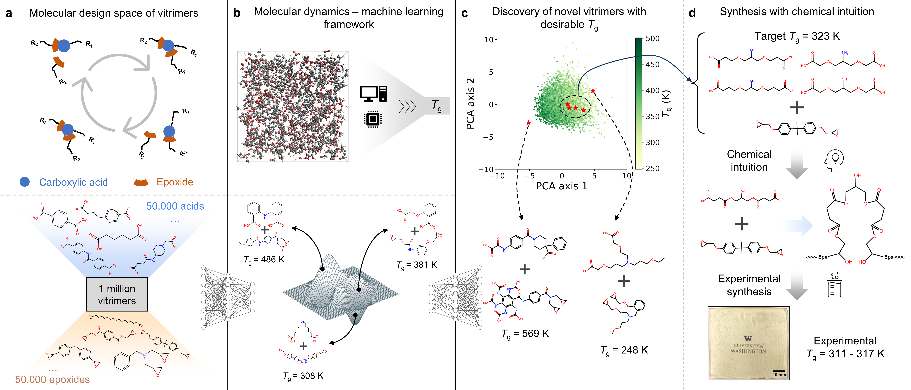

# VitrimerVAE
Codes and data used in the paper: AI-Guided Inverse Design and Discovery of Recyclable Vitrimeric Polymers https://doi.org/10.1002/advs.202411385

## ZINC
Datasets derived from ZINC15 database: 322K carboxylic acids, 625K epoxides, 1M vitrimers.

## MD
Density-temperature profiles and calculated *T*g of 8,424 vitrimers for data generation and discovered vitrimers by VAE and Bayesian optimization. Note: the *T*g values in `MD/generation/tg.csv` are calculated by MD simulations without calibration. We recommend using calibrated data (`Calibration/tg_vitrimer_calibrated.csv`) for any work.

## Calibration
The GP codes with Tanimoto kernal are based on https://github.com/Ryan-Rhys/The-Photoswitch-Dataset

The codes are tested in the following environment:
 - Python (3.10.8)
 - RDKit (2022.09.1)
 - GPflow (2.5.2)
 - TensorFlow (2.9.1)

1. Train a GP model and calibrate MD-simulated *T*g against experimental *T*g of vitrimers:\
`python calibrate.py`
2. Compare the performance of different calibration models by LOOCV:\
`python linear.py`\
`python RBF.py`\
`python Tanimoto.py`

The calibrated *T*g data (`Calibration/tg_vitrimer_calibrated.csv`) serves a proxy as experimental *T*g, which is also the training data for the VAE and the target of inverse design.

## VAE
The VAE codes are based on https://github.com/wengong-jin/hgraph2graph/

The overlapping latent dimension method is based on https://github.com/li-zhengz/UnifyingTrussDesignSpace

The codes are tested in the following environment:
 - Python (3.6.13)
 - PyTorch (1.10.1)
 - RDKit (2019.03.4)
 - networkx (2.2)
 - Numpy (1.19.2)

To train the VAE and generate novel vitrimers:
1. Exrtact motif vocabulary from training set:\
`python get_vocab.py --ncpu 32`

2. Preprocess molecules into tensors:\
`python preprocess.py --ncpu 32`

3. Train the VAE on the unlabeled dataset:\
`python train_vae.py --savedir results`

4. Train the VAE on the labeled dataset (joint training):\
`python train_vae_prop.py --savedir results --model 9.model`

5. Evaluate the trained models:\
`python evaluate.py --savedir results`

6. Extract latent vectors:\
`python latent_vector.py --savedir results`

7. Search in the neighborhood of a known vitrimer:\
`python search.py --savedir results`

8. Interpolate bewteen two vitrimers:\
`python interpolate.py --savedir results --method spherical`

9. Inverse design by Bayesian optimization:\
The Bayesian optimization codes are based on https://github.com/mkusner/grammarVAE#bayesian-optimization

 - Generate initial data points: `python bo_initial.py --savedir results`
 - Run Bayesian optimization: `python bo.py --savedir results --target 1`
 - Use `bo_initial_acid.py` and `bo_acid.py` for optimization of acids only

## BO
This folder contains 10 proposed vitrimers with validated (by MD simulation and GP calibration) *T*g of three targets:

1. *T*g = 248 K
2. *T*g = 373 K
3. Maximum *T*g
